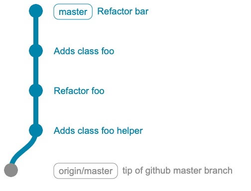
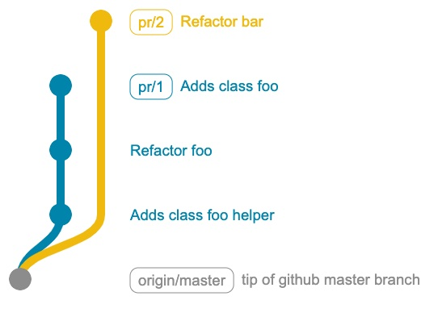

# Opp

Opp is an **O**pinionated **P**ull request **P**usher for github.

It takes away the hassle of going to the github UI to create and merge pull requests.

## Installing

```go install github.com/cupcicm/opp@latest```

## Demo

[](https://asciinema.org/a/4xyPLvoSirJ0r9iK2YCDQz7Zv)

## Usage

Let's say your history is this



You can create two separate PRs like this
| Independent PRs | Dependent PRs |
|---|---|
| <pre>opp pr HEAD^<br>opp pr --base master HEAD</pre> | <pre>opp pr HEAD^<br>opp pr HEAD</pre> |
|  |   |
| You can merge either pr/1 or pr/2 first | You need to merge pr/1 first as pr/2 depends on it |

## Features

- Create pull requests without having to choose (or remember) a branch name: opp creates a local branch called pr/1234 to match PR #1234.
- push, pull and merge from the command line: `opp push` / `opp pull` / `opp merge`
- easily create sets of dependant PRs: ask for review on PR 2 that depends on PR 1 being merged. Then `opp` will take care of merging them in the right order.
- Don't write the PR description yourself. opp chooses the longest commit message in your commits and uses it as the description.

# Questions / contributions

- please feel free to create issues
- or send pull requests
- or come discuss it on discord : [](https://discord.gg/V8Pgr46gQP)

